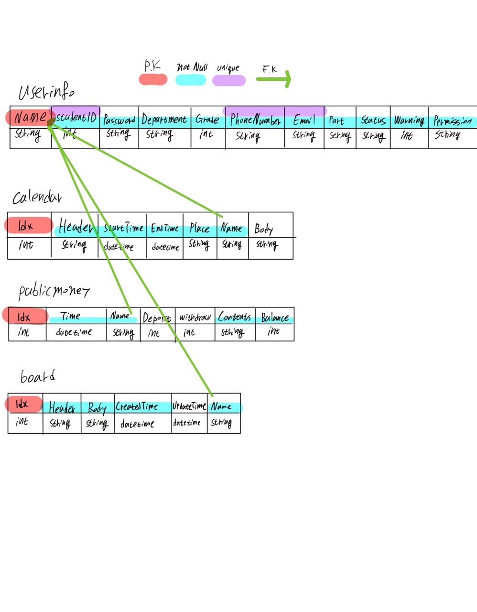

## 1. 프로젝트 설명

- 일정, 공금내역, 게시판 등이 있는 간단한 서비스를 수행 가능한 Example Server를 만드는것이 프로젝트의 주된 목적  
- Node.js와 Express를 이용한 REST API설계로 만들어진 서버이며 유지보수를 위해 Swagger를 사용.  

## 2. 프로젝트 구성

- Framework: express 4.17.1
- Node.js: 14.15.3
- MySql: 8.0.23
- Swagger

## 3. API  

- Swagger API문서의 주소: **host:port/api-docs**  

### 3-1 구현된 API

- /routes/User.js
    - User 회원가입
    - User 로그인
    - ID 중복확인
    - PASSWORD 찾기
    - PASSWORD 변경
    - User 정보 조회
    - User 정보 수정
    - User 삭제
- /routes/Calendar.js
    - 일정 작성
    - 일정 목록 조회
    - 일정 수정
    - 일정 삭제
- /routes/PublicMoney.js
    - 공금 내역 작성
    - 공금 목록 조회
    - 공금 내역 수정
    - 공금 내역 삭제
- /routes/Board.js
    - 게시글 작성
    - 게시글 목록 조회
    - 게시글 수정
    - 게시글 조회
    - 게시글 삭제

### 3-2 Swagger

- /swagger.js
    - config file

## 4. 데이터베이스 구성



## 5. 데이터베이스 작성

```bash
// 데이터베이스 생성
mysql> create database testdb;

// 테이블 생성
mysql> use testserver;

// UserInfo 테이블 생성
mysql> create table userinfo (Name varchar(255) primary key not null, studentID int unique not null, Password varchar(255) not null, Department varchar(255) not null, Grade int not null, PhoneNumber varchar(255) unique not null, Email varchar(255) unique not null, Part varchar(255) not null, Status varchar(255) not null, Warning int not null, Permission varchar(255) not null);
// charset 변경
mysql> ALTER TABLE userinfo convert to charset utf8;
// test data 삽입
mysql> insert into userinfo values("junho", 19121426, "test1234", "사이버보안", 5, "010-3302-7492", "jewel7492@naver.com", "개발", "재학", 0, "True");

// Calendar 테이블 생성
mysql> create table calendar (Idx int primary key auto_increment, Header varchar(255) not null, StartTime datetime not null, EndTime datetime not null, Place varchar(255) not null, Name varchar(255) not null, Body varchar(255));
// charset 변경
mysql> ALTER TABLE calendar convert to charset utf8;
// Foreign Key 설정
mysql> alter table calendar add foreign key (Name) references userinfo (Name);
// test data 삽입
mysql> insert into calendar values(null, "Header", now(), now(), "D2-558", "junho", "testBody");

// PublicMoney 테이블 생성
mysql> create table publicmoney (Idx int primary key auto_increment, Time datetime not null, Name varchar(255) not null, Deposit int, Withdraw int, Contents varchar(255) not null, Balance int not null);
// charset 변경
mysql> ALTER TABLE publicmoney convert to charset utf8;
// Foreign Key 설정
mysql> alter table publicmoney add foreign key (Name) references userinfo (Name);
// test data 삽입
mysql> insert into publicmoney values(null, now(), "junho", 5200, 0, "입금", 5200);

// Board 테이블 생성
mysql> create table board (Idx int primary key auto_increment, Header varchar(255) not null, Body varchar(255) not null, CreatedTime datetime not null, UpdateTime datetime, Name varchar(255) not null);
// charset 변경
mysql> ALTER TABLE board convert to charset utf8;
// Foreign Key 설정
mysql> alter table board add foreign key (Name) references userinfo (Name);
// test data 삽입
mysql> insert into board values(null, "Header", "testBody", now(), null, "junho");

mysql> ALTER USER 'root'@'localhost' IDENTIFIED WITH mysql_native_password BY 'Password';
mysql> exit
```

## 6. 자료

> https://limjunho.github.io/archive.html?tag=MySql **MySql 정리글**  
> https://limjunho.github.io/archive.html?tag=Node.js **Node.js 정리글**  
> https://limjunho.github.io/2020/10/10/Node.js-Restful-API.html **Restful API 정리글**  
> https://limjunho.github.io/ **개인 Blog 주소**
